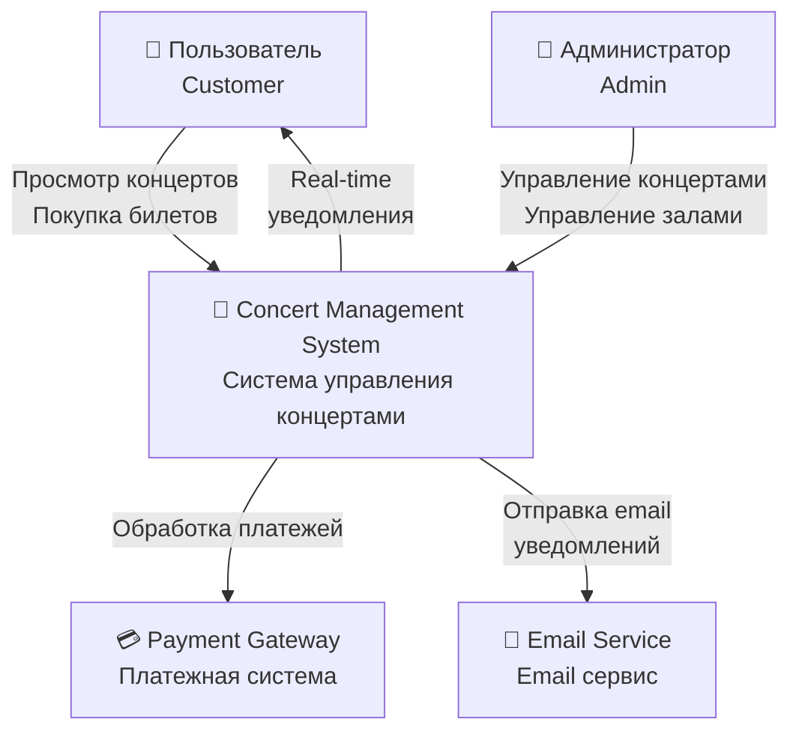
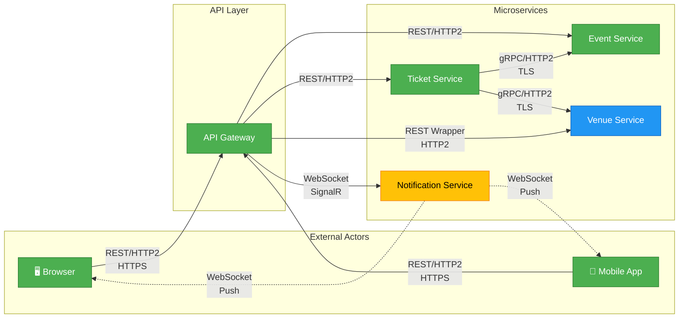
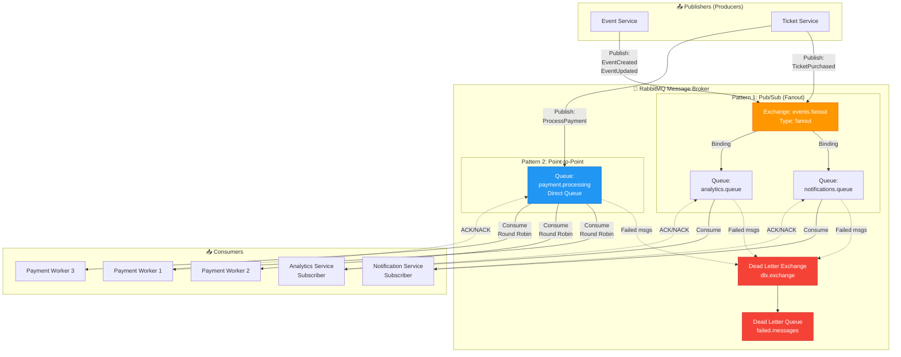

# Архитектурные диаграммы системы

## 1. System Context Diagram (Контекстная диаграмма)

Диаграмма показывает взаимодействие системы с внешними акторами.

## 2. Network Protocol Usage Map

Карта использования протоколов в системе.

## 3. Data Flow Diagram: Message Broker Patterns

Поток данных через RabbitMQ.

**Преимущества:**
- ✅ Низкая latency для клиента
- ✅ Decoupling - сервисы не знают друг о друге
- ✅ Отказоустойчивость - если consumer down, сообщения в очереди
- ✅ Легко добавлять новых consumers